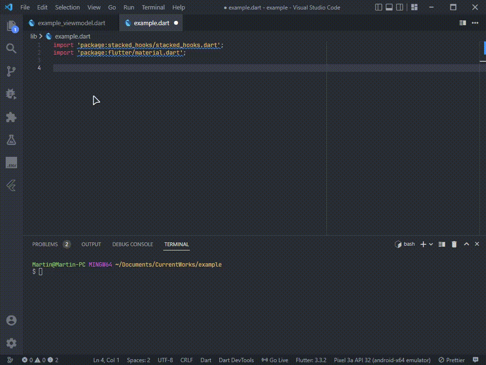

# README

A set of helpful Flutter and Dart snippets for day to day Flutter development.

## Features

Simply Flutter set of snippets for sacked arquitecture

I'm working hard to select all the day to day widgets, so wait for more!.

## Snippets

- ### Stacked Arquitecture related snippets

| Snippet      | Description                                                                       
| ------------ | --------------------------------------------------------------------------
| `vmw`        | Creates a ViewModel Widget from stacked package with a given viewModel    
| `lservice`   | Creates a Service with lazySingleton annotation from injectable package   
| `cds`        | Creates a DataSource from the ChopperApi with a basic structure              
| `jmodel`     | Creates a model with annotations from json annotations package            
| `bvm`        | Creates a ViewModel based on a existing base ViewModel                             
| `brep`       | Creates a repository with a given datasource                               
| `sview`      | Creates a stacked view from a ViewModel                                   

- ### Flutter related snippets

| Snippet | Description                                   
| ------- | --------------------------------------------- 
| `impst` | Generate stacked package import        
| `sbh`   | Create a Sized Box with a given height        
| `sbw`   | Create a Sized Box with a given width         
| `csbh`  | Create a const Sized Box with a given height  
| `csbw`  | Create a const Sized Box with a given width   
| `vmbr`  | Creates a reactive ViewModelBuilder           
| `vmbn`  | Creates a non reactive ViewModelBuilder       
